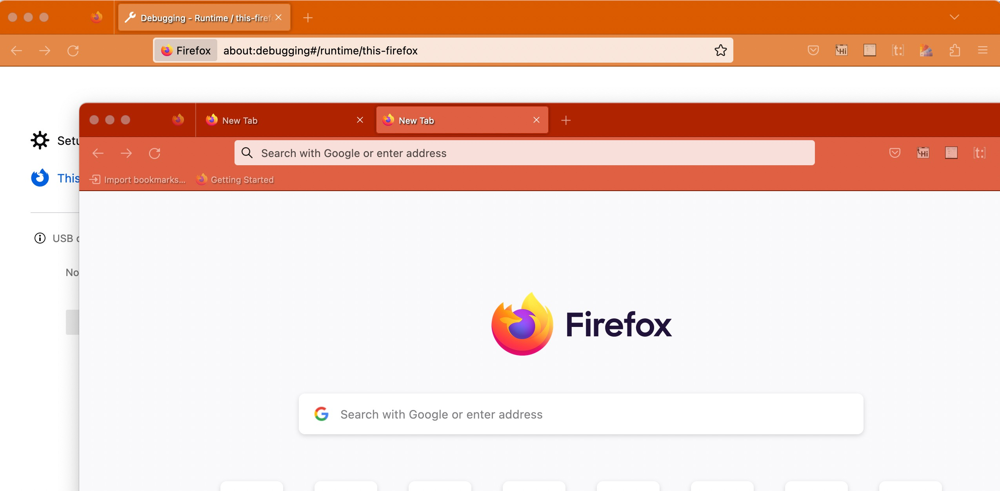

# Tab Bar Coloring
## Overview

This Firefox web-extension allows users to change color of the browser title bar by simply selection options from the popup manu. It also supports having different colors for different windows. 

## Team
- [Grace Zhang](https://github.com/gracezhang89)
- [Riya Singh](https://github.com/rs1dev)
- [Romee Zhou](https://github.com/ROMEEZHOU)

## Examples
The screenshot below shows having two different title bar colors for different windows. The text is always set to white. And one may easily press the reset button to make the theme of a certain window go back to default mode.

## Installation